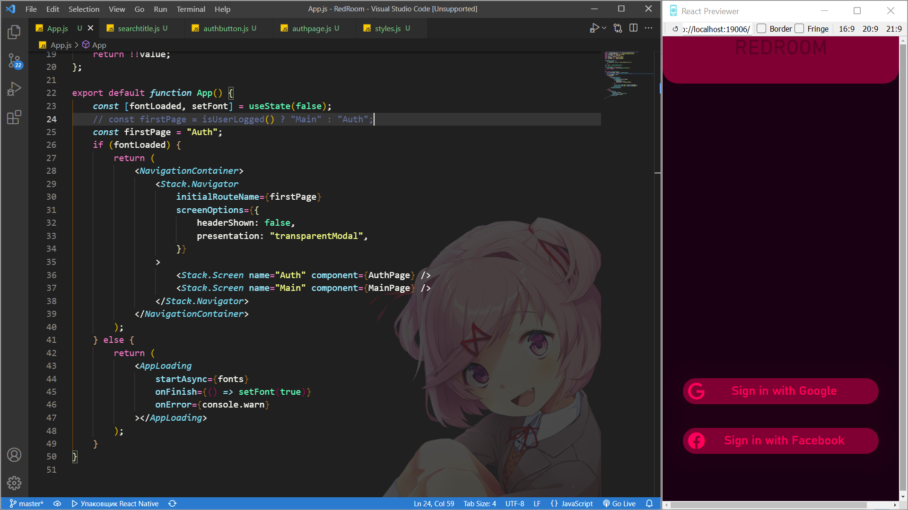
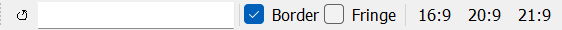
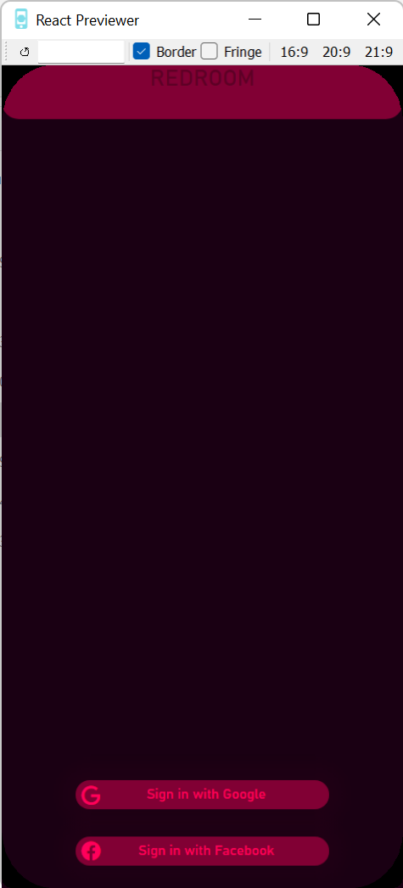
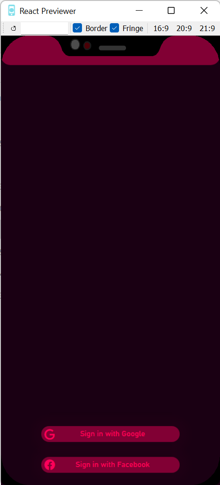

  
  <h1 align="center">React Previewer</h1>

# What
VERY simple browser based on PySide WebView that provides easy ReactNative applications preview in standalone window

# Creating reason

That program was created cause ReactNative has handy feature - browser preview - but most of browsers have fixed minimum width of window (and build-in vs code browsers from extension too) and you can not open it with your code editor convenient.

But with this application your workspace may look like that: 

# Features
<h3>All browser functionality consists in menu bar:</h3>

So, you can:
- Reload page
- Change url
- Enable border
- Enable fringe
- Change size ratio

<h3>
	If border or/and fringe enabled rounded borders and fringe images stack on page:
</h3>

	
	

# Compilation instruction

If you want to compile program to binary install pyinstaller (https://pyinstaller.readthedocs.io/en/stable/usage.html) and run that command in terminal at ReactPreviewer directory:

<strong>$ pyinstaller main.spec</strong>
